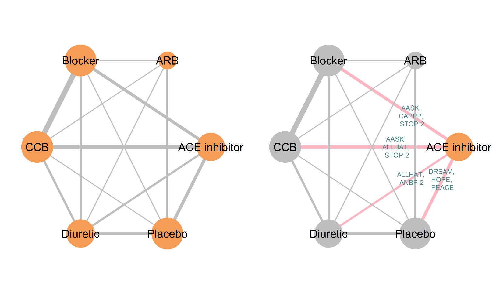

[[Home](index.md)]  [[Installation](instructions.md)] [[RStudio Server](https://spintechit.com/bugsnet-demo-request/)] [[Vignettes](vignettes)]

# BUGSnet R package

## Preamble

The number of publications using network meta-analysis (NMA) has increased dramatically within the past decade. Despite this increase, several reviews have noted shortcomings with respect to the quality of the conduct and reporting of NMAs. Network meta-analyses should be conducted and reported according to published best practices guidelines, namely the [PRISMA](https://www.ncbi.nlm.nih.gov/pubmed/26030634), [ISPOR-AMPC-NCA](https://www.ncbi.nlm.nih.gov/pubmed/24636374) and [NICE-DSU](http://nicedsu.org.uk/wp-content/uploads/2016/03/TSD7-reviewer-checklist.final_.08.05.12.pdf) guidelines. These guidelines request numerous outputs that a single package does not currently provide. Moreover results (especially plots) are not publication-ready and often considerable time and effort must be spent to get them into a presentable state. 

BUGSnet is a new feature-rich R package to conduct high-quality Bayesian NMA analyses and facilitate compliance with best practice guidelines and reporting. Bayesian analyses are conducted with [JAGS](http://mcmc-jags.sourceforge.net/) (BUGS code is automatically generated by the package based on the user's inputs.) Outputs are highly customizable and include [network plots](images/network.png), tables of network characteristics, [data plots](images/covariate.png), league tables and [league heat plots](images/league.png), [SUCRA plots](images/SUCRA.png), rankograms, forest plots, [leverage plots](images/fit.png), traceplots and posterior mean deviance comparison plots.

We hope that this software will help improve the conduct and reporting of NMAs.

## **Install BUGSnet on your machine (NEW)**

To install BUGSnet on your machine, please follow the instructions by clicking on the link below.

[BUGSnet 1.0.3](instructions) 
([What's new?](https://github.com/audrey-b/BUGSnet/raw/master/WHATSNEW.md))
([Manual](https://github.com/audrey-b/BUGSnet/raw/master/manual.pdf))

[Archived versions](archived)

## Access the BUGSnet RStudio server

You may prefer to use BUGSnet on our RStudio server. Academic use is free. [Click here to request access](https://spintechit.com/bugsnet-demo-request/).

## **Start using BUGSnet**

Please follow the code in our demonstration [vignettes](vignettes).

## License

BUGSnet is available under the [Creative Commons Attribution-NonCommercial-ShareAlike 4.0 International License (CC
BY-NC-SA 4.0)](https://creativecommons.org/licenses/by-nc-sa/4.0/). Kindly review the [license](https://creativecommons.org/licenses/by-nc-sa/4.0/legalcode). You are responsible for conforming to the terms of this license. BUGSnet is provided as-is and comes with absolutely no guarantees. Commercial use is prohibited under this license; contact the authors for more information.

## How to cite BUGSnet?

Béliveau A., Boyne D., Slater J., Brenner D. and Arora P. (2019). BUGSnet: an R package to facilitate the conduct and reporting of
Bayesian network Meta-analyses. *BMC Medical Research Methodology*, 19(196).

## Support or Contact

Having trouble? Or want to suggest an improvement to BUGSnet? Please fill an issue [here](https://github.com/bugsnetsoftware/BUGSnet/issues).

Contact the authors: 
- [Audrey Beliveau (academic)](https://uwaterloo.ca/statistics-and-actuarial-science/about/people/a2belive)
- [Lighthouse Outcomes (academic, commercial)](http://www.lighthouseoutcomes.com/bugsnet/)
